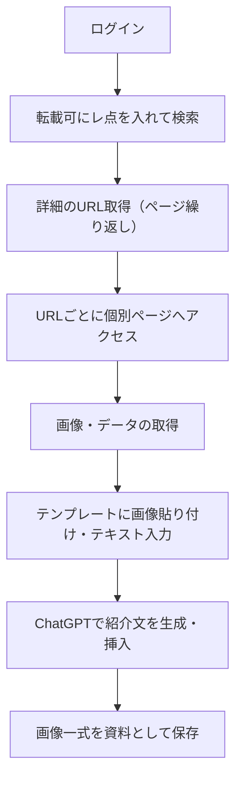

# tokyu_sns_image_tool

東急受託リース向けに開発された、SNS投稿用画像・文章を自動生成するための準備ツールです。
特定ページ上の「NEW」データを抽出し、それを元にSNS投稿素材となるテンプレート画像を自動で作成。


<br>


## 機能概要

- 対象ページへの自動ログイン
- 「NEW」付きテーブル行からURLをリスト取得（ページネーション対応）
- 各URLから画像・データを取得
- テンプレートへ自動貼り付け・文字入力
- ChatGPTを活用した紹介文の自動生成・挿入
- 画像一式をSNS投稿素材として生成


<br>


## 処理フロー



<br>


## 使用技術

- **Python** 3.10.7
- **Selenium**（ブラウザ操作）
- **BeautifulSoup4**（HTML解析）
- **Pillow / OpenCV**（画像処理）
- **OpenAI API**（ChatGPT連携）
- **その他**：PyPDF2 / fpdf など（テンプレート組み込みに応じて）

<br>

## 作業を始める前に

- **GitHubの `Projects`（カンバン形式）と `Issues` を必ず確認してください。**
- **自分にアサインされているIssue** がある場合、そこから着手してください。
- 作業開始前に、`05_branch_guide.md` の手順に沿ってブランチを作成しましょう。
- プルリクエスト時は、必ず `06_commit_guide.md` と `07_pr_guide.md` を参照し、ルールに従ってください。

<br>


## 詳細ドキュメント（必読）
このREADMEは概要のみです。<br>
実装・運用に関する詳細ルールは以下のドキュメントを参照してください：
```bash
docs/
├── 00_setup_guide.md        # 初期セットアップ手順
├── 01_security_key_guide.md # セキュリティキーの取り扱いルール
├── 02_naming_guide.md       # 命名規則
├── 03_dir_guide.md          # ディレクトリ構成ルール
├── 04_coding_guide.md       # コーディング規約
├── 05_branch_guide.md       # ブランチの作成ルール
├── 06_commit_guide.md       # コミットメッセージの書き方
├── 07_pr_guide.md           # プルリクエストの流れ
├── 08_comment_guide.md      # コメントの付け方
├── 09_selenium.md           # Seleniumの操作ルール
├── 10_const_guide.md        # 定数定義のルール
```
記述方法などを確認したい場合、上記の各ドキュメントを参考にしてください。


