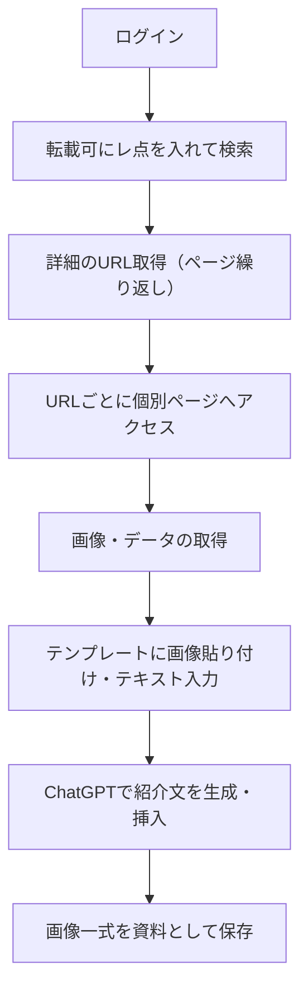

# tokyu_sns_image_tool

東急受託リース向けに開発された、SNS投稿用画像・文章を自動生成するための準備ツールです。
特定ページ上の「NEW」データを抽出し、それを元にSNS投稿素材となるテンプレート画像を自動で作成します。

---

## 🔧 機能概要

- 対象ページへの自動ログイン
- 「NEW」付きテーブル行からURLをリスト取得（ページネーション対応）
- 各URLから画像・データを取得
- テンプレートへ自動貼り付け・文字入力
- ChatGPTを活用した紹介文の自動生成・挿入
- 画像一式をSNS投稿素材として生成

---

## 📌 処理フロー



## 使用技術

- **Python** 3.10.7
- **Selenium**（ブラウザ操作）
- **BeautifulSoup4**（HTML解析）
- **Pillow / OpenCV**（画像処理）
- **OpenAI API**（ChatGPT連携）
- **その他**：PyPDF2 / fpdf など（テンプレート組み込みに応じて）

## セットアップ方法
```
git clone https://github.com/your-user/tokyu_sns_image_tool.git
cd tokyu_sns_image_tool

# 仮想環境推奨
python -m venv venv
source venv/bin/activate  # Windowsなら venv\Scripts\activate

pip install -r requirements.txt

```

## 使用方法（実行手順）
```
python main.py
```
または GUI / CLI を提供する場合はその方法を記載。


## ディレクトリ構成（例）
```
tokyu_sns_image_tool
├── docs
│   ├── 00_setup_guide.md
│   ├── 01_usage_guide.md
│   ├── 02_requirements_notes.md
│   ├── 03_project_structure.md
│   ├── 04_api_keys_handling.md
│   ├── 05_dev_rules.md
│   ├── 06_naming_convention.md
│   ├── 07_git_flow.md
│   ├── 08_commit_message_format.md
│   ├── 09_branching_rule.md
│   ├── 10_pr_guidelines.md
│   ├── 11_pr_template.md
│   ├── 12_merge_policy.md
│   ├── 13_review_checklist.md
│   ├── 15. comment_guide.md
│   ├── 16_selenium_selector_guideline
│   └── 17_selenium.md
├── installer
│   ├── bin
│   │   ├── bat
│   │   └── requirements.txt
│   ├── config
│   │   └── config.json
│   ├── data
│   │   ├── input
│   │   │   ├── fonts
│   │   │   │   └── MPLUSRounded1c-ExtraBold.ttf
│   │   │   └── template
│   │   │       ├── A.png
│   │   │       ├── B.png
│   │   │       ├── C.png
│   │   │       ├── D.png
│   │   │       └── LAST.png
│   │   └── output
│   │       └── logs
│   ├── src
│   │   ├── flow
│   │   │   ├── base
│   │   │   │   ├── chrome.py
│   │   │   │   ├── image_editor.py
│   │   │   │   ├── path.py
│   │   │   │   ├── selenium.py
│   │   │   │   └── sqlite.py
│   │   │   ├── generate_image_flow.py
│   │   │   ├── input_db_flow.py
│   │   │   ├── main_flow.py
│   │   │   └── scraper_flow.py
│   │   └── main.py
│   └── tests
├── README.md
└── requirements.txt
```


