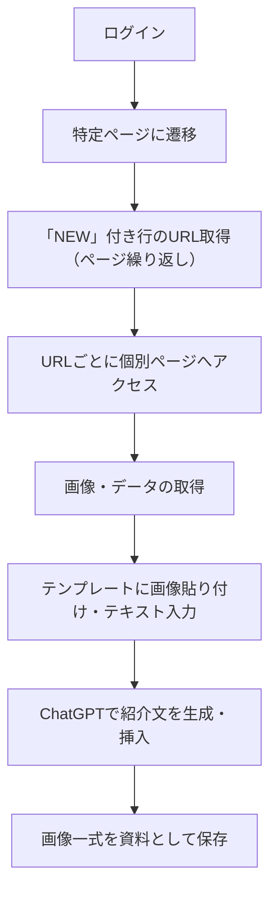

# tokyu_sns_image_tool

東急受託リース向けに開発された、SNS投稿用画像・文章を自動生成するための準備ツールです。  
特定ページ上の「NEW」データを抽出し、それを元にSNS投稿素材となるテンプレート画像を自動で作成します。

---

## 🔧 機能概要

- 対象ページへの自動ログイン
- 「NEW」付きテーブル行からURLをリスト取得（ページネーション対応）
- 各URLから画像・データを取得
- テンプレートへ自動貼り付け・文字入力
- ChatGPTを活用した紹介文の自動生成・挿入
- 画像一式をSNS投稿素材として生成

---

## 📌 処理フロー



## 使用技術

- **Python** 3.10.7
- **Selenium**（ブラウザ操作）
- **BeautifulSoup4**（HTML解析）
- **Pillow / OpenCV**（画像処理）
- **OpenAI API**（ChatGPT連携）
- **その他**：PyPDF2 / fpdf など（テンプレート組み込みに応じて）

## セットアップ方法
```
git clone https://github.com/your-user/tokyu_sns_image_tool.git
cd tokyu_sns_image_tool

# 仮想環境推奨
python -m venv venv
source venv/bin/activate  # Windowsなら venv\Scripts\activate

pip install -r requirements.txt

```

## 使用方法（実行手順）
```
python main.py
```
または GUI / CLI を提供する場合はその方法を記載。


## ディレクトリ構成（例）
```
yahoo_auction_scraper/
├── README.md                      # プロジェクト概要・ルール・処理フローなど
├── .gitignore                     # 不要ファイルのGit管理除外設定
├── requirements.txt               # 必要ライブラリ一覧（開発・教育用）
├── docs/                          # 開発支援資料（納品時は除外）
│   ├── setup_guide.md             # 環境構築・実行手順
│   ├── design.md                  # 設計概要と命名ルール
│   └── flow_spec.md               # 処理フローの詳細定義
├── tests/                         # 単体テスト（教育用、納品時は除外）
│   └── test.py                    # テストファイル
└── installer/                     # 納品対象一式（以下のみを相手に渡す）
    ├── run.bat                    # Windows用実行スクリプト
    ├── requirements.txt           # 必要ライブラリ一覧（納品用）
    ├── config/
    │   └── credentials.json       # Google Sheets APIキー（Git除外）
    ├── data/
    │   ├── input/                 # 商品画像の保存先
    │   └── output/                # 出力CSV等（必要に応じて）
    │       └── logs/              # logファイル（日付順で作成）
    └── src/
        ├── main.py                # 実行起点（YahooFlowを呼び出し）
        └── flow/
            ├── main_flow.py          # 一連の処理フロー
            ├── detail_page_flow.py   # 詳細ページの処理フロー
            └── base/
                ├── chrome.py              # Chrome（クラス名：Chrome）
                ├── selenium.py            # Selenium（クラス名：Selenium）
                ├── spreadsheet_read.py    # スプシ読取（クラス名：SpreadsheetReader）
                ├── spreadsheet_write.py   # スプシ書込（クラス名：SpreadsheetWriter）
                ├── number_calculator.py   # 数値計算（クラス名：PriceCalculator）
                ├── url_builder.py         # URL作成（クラス名：UrlBuilder）
                └── utils.py               # 汎用関数（クラス名なし or Utils）
```


